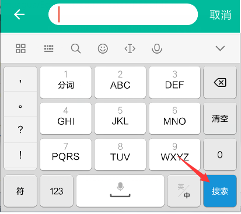

# EditText

### 搜索功能<br>
----
##### 效果图<br>

##### xml设置<br>
```xml
<EditText
     android:id="@+id/name_input"
    android:layout_width="match_parent"
    android:layout_height="match_parent"
    android:imeOptions="actionSearch"
    android:singleLine="true" />
```
android:imeOptions设置成actionSearch为搜索功能，设置成actionDone确定功能，
一定要用android:singleLine="true"，不能用android:maxLines="1"，否则无效<br>

##### java代码<br>
```java
nameInput.setOnEditorActionListener(new TextView.OnEditorActionListener() {
            @Override
            public boolean onEditorAction(TextView textView, int i, KeyEvent keyEvent) {
            if (i == EditorInfo.IME_ACTION_SEARCH) {
                    // 先隐藏键盘
                    ((InputMethodManager) getSystemService(Context.INPUT_METHOD_SERVICE))
                            .hideSoftInputFromWindow(getCurrentFocus().getWindowToken(),
                                    InputMethodManager.HIDE_NOT_ALWAYS);
                                    
                       checkInput();//执行搜索，此处为验证
                    
                    return true;
                }
                return false;
            }
        });
```
一定要加if (i == EditorInfo.IME_ACTION_SEARCH)判断，要不然checkInput()会执行两遍

### 验证功能<br>
----
##### 效果图<br>

##### java代码<br>
```java

EditText nameInput;

private void checkInput() {
        nameInput.setError(null);
        String name = objectNameInput.getText().toString();

        boolean cancel = false;
        
        View focusView = null;
        
        if (TextUtils.isEmpty(name)) {
            nameInput.setError("姓名不能为空");//设置错误提示内容
            focusView = nameInput;
            cancel = true;
        } 

        if (cancel) {
            focusView.requestFocus();
        } else {
            //验证成功
        }
    }
```
